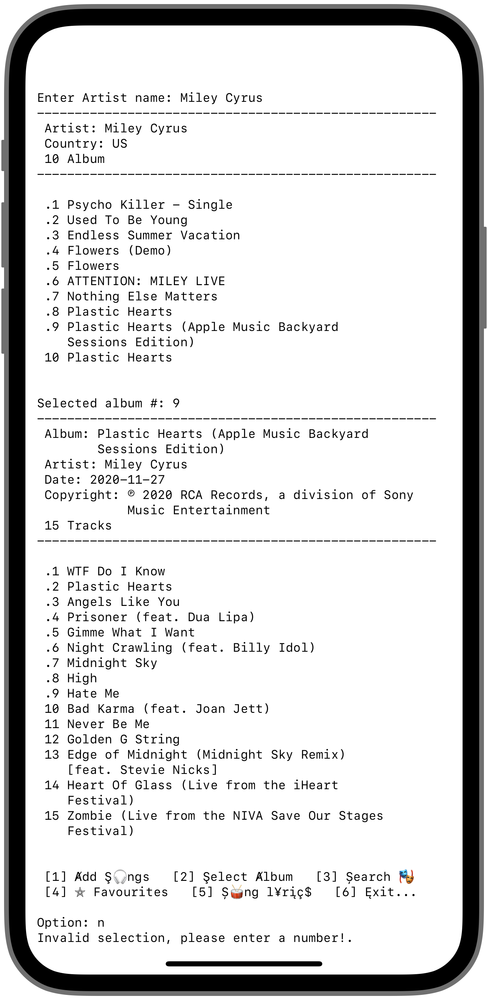

# musixmatchAPI
Musixmatch API with QUEUE data structure on python

```sh
git clone https://github.com/brunomaldonado/musixmatchAPI.git
cd musixmatchAPI
python3 main.py
```

##### To run mediaPlayer, uncomment and comment line 3, 4

```sh
cd utils/
python3 mediaPlayer.py
# from config import content_data, example, media_songs_list
# from queueNode import Queue
```

<p align="center">
  
&nbsp; &nbsp; &nbsp; &nbsp;
  
</p>
<!-- <p align="center">
  
&nbsp; &nbsp; &nbsp; &nbsp;
  
</p> -->
