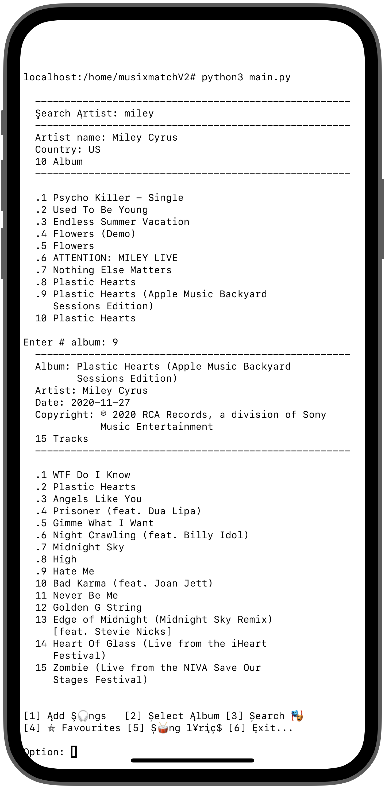

# musixmatchAPI
Musixmatch API with QUEUE data structure on python

<!-- <table>
  <tr>
    <td valign="top"></td>
    <td valign="top"></td>
  </tr>
</table> -->

  
&nbsp; &nbsp; &nbsp; &nbsp;
  

<!-- 

  
&nbsp; &nbsp; &nbsp; &nbsp;
  

 -->